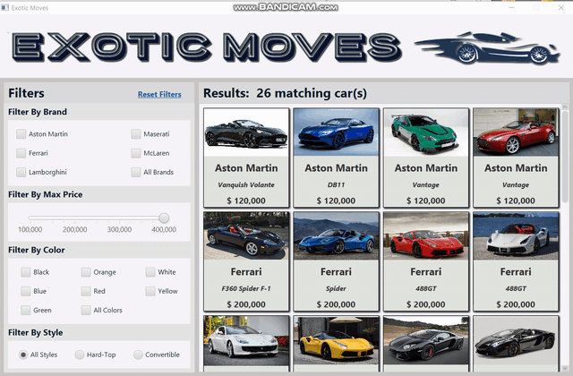
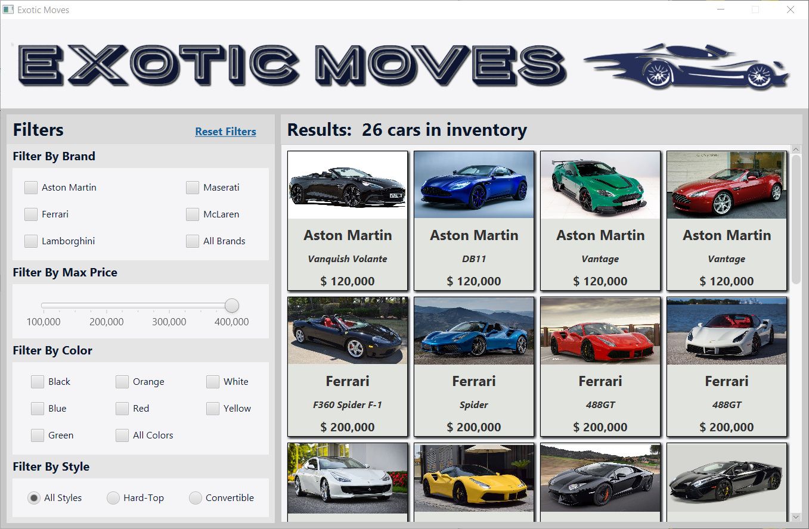
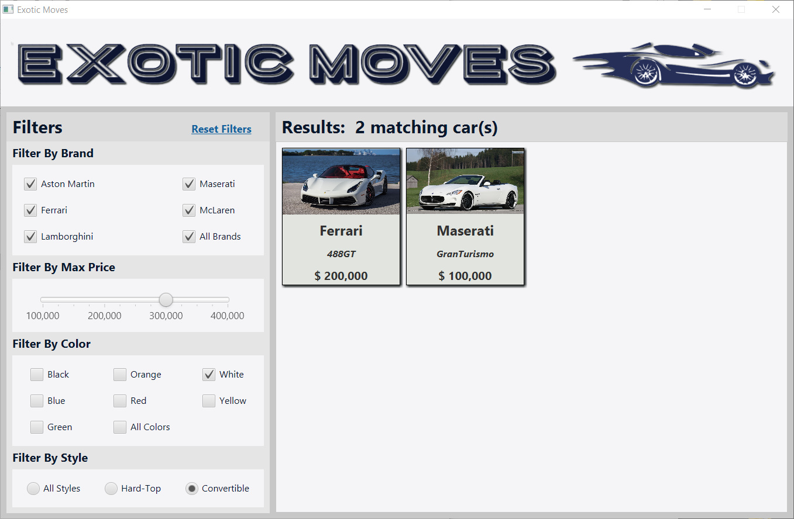
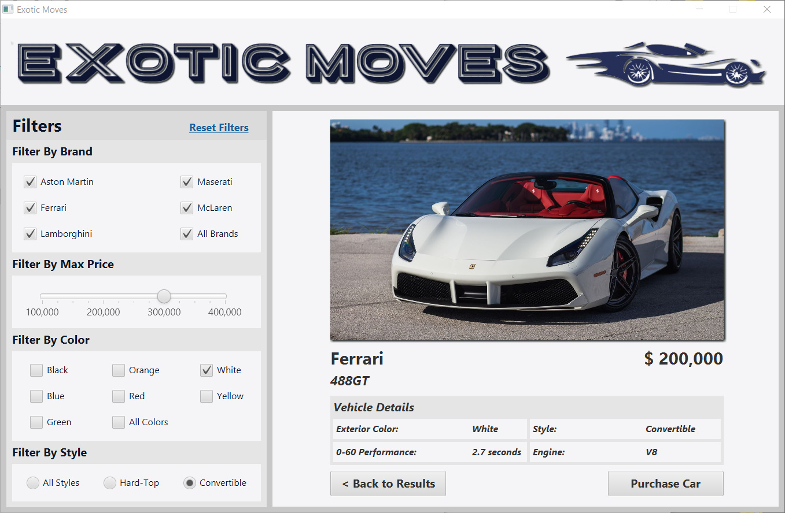
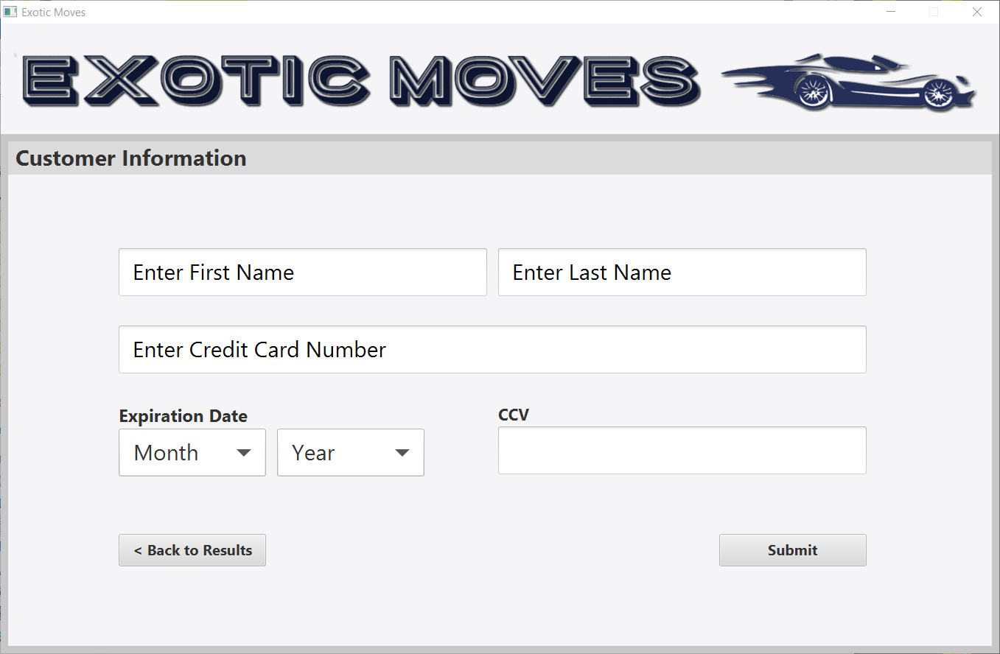
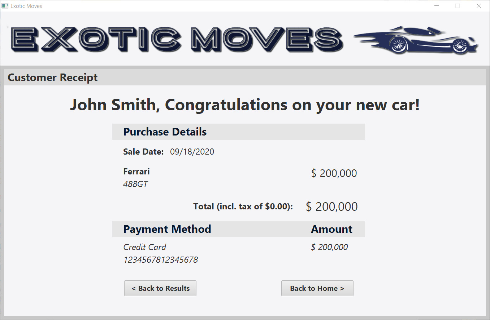

# Car_Dealership_Program_Final_Project_Java-2
A program for a car dealership that allows the user to filter car inventory and then purchase the car.

## Program Demonstration

## Program Features
* Multiple Filtering Options
* Input Validation

## Program Screenshots

